

<!-- PROJECT LOGO -->
 

  

  

    This outlines the project codebase for AY2022/2023 Semester 2 IS213 ESD - G3T3 
  

<!-- TABLE OF CONTENTS -->

  
Table of Contents

  <ol>
    <li>
      <a href="#travelnest">TravelNest</a>
      <ul>
        <li><a href="#technical-diagrams">Technical Diagrams</a></li>
      </ul>
    </li>
    <li>
      <a href="#built-with">Built With</a>
      <ul>
        <li><a href="#frontend">Frontend</a></li>
        <li><a href="#api-gateway">API Gateway</a></li>
	<li><a href="#backend">Backend</a></li>
        <li><a href="#message-broker">Message Broker</a></li>
	<li><a href="#devops">DevOps</a></li>
        <li><a href="#deployment">Deployment</a></li>
	<li><a href="#external-apis-used">External APIs used</a></li>
      </ul>
    </li>
    <li>
      <a href="#getting-started">Getting Started</a>
      <ul>
        <li><a href="#configuring-backend">Configuring Backend</a>
            <ul>
                <li><a href="#create-a-user-account-in-phpmyadmin">Create a user account in phpMyAdmin</a></li>
                <li><a href="#prerequisites">Prerequisites</a>
                    <ul>
                        <li><a href="#install-docker-desktop">Install Docker Desktop</a></li>
                        <li><a href="#dependencies">Dependencies</a></li>
                    </ul>
                </li>
            </ul>
        </li>
      </ul>
    </li>
    <li><a href="#usage">Usage</a>
        <ul>
            <li><a href="docker-compose">Docker Compose</a></li>
            <li><a href="setting-up-kong-api-gateway">Setting up KONG API Gateway</a></li>
            <li><a href="accessing-travelnest-website">Accessing TravelNest website</a></li>
            <li><a href="test-out-twilio-api">Test out twilio API</a></li>
            <li><a href="to-stop-running">To stop running</a></li>
        </ul>
    </li>
    <li><a href="#scenario-1">Scenario 1</a>
        <ul>
            <li><a href="#payment-credentials">Payment Credentials</a></li>
        </ul>
    </li>
    <li><a href="#scenario-2">Scenario 2</a></li>
    <li><a href="#scenario-3">Scenario 3</a></li>
    <li><a href="#additional-points">Additional Points</a></li>
    <li><a href="#acknowledgments">Acknowledgments</a></li>
  </ol>

<!-- ABOUT THE PROJECT -->
## TravelNest
TravelNest focuses on the idea of connecting travellers with property owners who are renting out their properties across the world. The 2 main users of our application are renters and property owners. 

### Technical Diagrams

	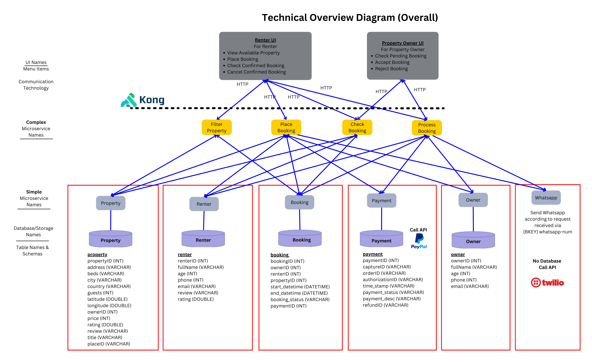
	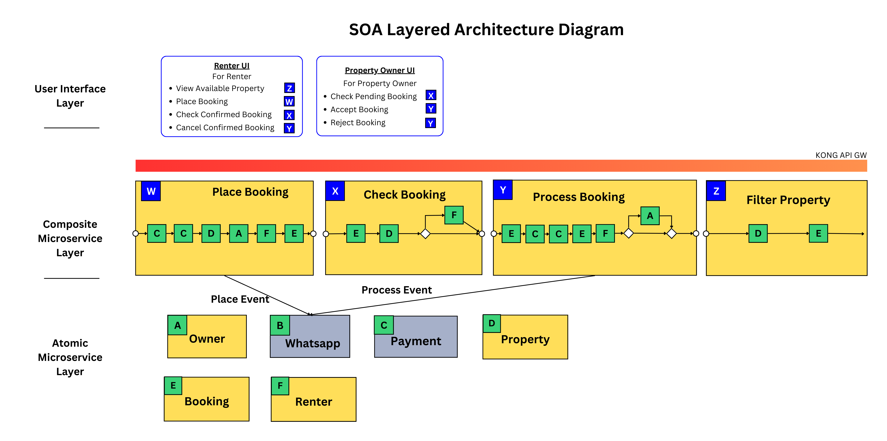
    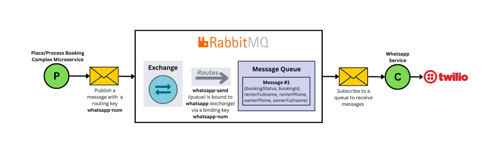

(<a href="#top">back to top</a>)

## Bulit With

### Frontend
* HTML
* CSS
* Javascript
* [Bootstrap v5.2] (https://getbootstrap.com/docs/5.2/getting-started/introduction/)
* [Vue.js](https://vuejs.org/)

### API Gateway
* [KONG](https://konghq.com)

### Backend
* [Java Spring Boot](https://spring.io/)
* [Python](https://python.org/)
* [MySQL](https://www.mysql.com/)

### Message Broker
* [RabbitMQ](https://rabbitmq.com)

### DevOps
* [Docker](https://docker.com)

### External APIs used
* [PayPal API](https://developer.paypal.com/docs/api/payments/v1/#payment_create)
* [Twilio API](https://www.twilio.com/docs/sms/api)
* [Google Places API](https://developers.google.com/maps/documentation/places/web-service/details)

(<a href="#top">back to top</a>)

<!-- GETTING STARTED -->
## Getting Started
### Configuring Backend

#### Create a user account in phpMyAdmin

- Start WAMP Server and Log In to phpMyAdmin

- [User Account setup in phpMyAdmin](https://docs.google.com/document/d/1CENo-uqUGj9LfjsD90dyO4MKehg3-8wGbxSZRmjqfws/edit?usp=sharing)

#### Prerequisites

##### Install Docker Desktop
- Sign up for a Docker ID @ https://hub.docker.com and then download Docker Desktop from https://www.docker.com/get-started.

##### Dependencies 
NO ACTION IS REQUIRED FROM YOU AS THESE WILL BE INSTALLED AUTOMATICALLY

- amqp.reqs.txt
- http.reqs.txt

HOWEVER, if you happen to encounter problems with the installations when running up the application with docker compose, you may execute this command ``python -m pip install flask`` to ensure that you have the same version installed. 

Here are the commands that you can execute to manually install:
__Note: for mac users, you may need to type "python3" instead of "python"__`
* Flask - 2.2.3 ``python -m pip install flask``
* Flask-Cors - 3.0.10 ``python -m pip install flask_cors``
* Flask-SQLAlchemy - 3.0.3 ``python -m pip install Flask-SQLAlchemy``
* requests - 2.28.2 ``python -m pip install requests``
* mysql-connector-python - 8.0.32 ``python -m pip install mysql-connector-python``
* pika - 1.3.1 ``python -m pip install pika``
* twilio - 7.17.0 ``python -m pip install twilio``

(<a href="#top">back to top</a>)

<!-- USAGE EXAMPLES -->
## Usage
### Docker Compose 

Make sure you have a clean environment and that no other containers is up and running as it may conflict with this project's ports mapping, image or container naming/labelling. 
__If you already have a Kong container and image in docker desktop, please ensure to remove them along with its network to set up a new kong configuration.__` 

1. From the directory ./travelnest, open the terminal and execute the following command: 

``docker-compose up``

__you may have to wait a few minutes for the app to start up, if you see error like pika.BlockingConnection, please DO NOT force stop the container, this error is appearing simply because rabbitmq needs time to start up.__

### Setting up KONG API Gateway 
do this only AFTER 14/15 containers are up and running 
__(kong-migration is expected to exit)__

- [Kong API Gateway setup](https://docs.google.com/document/d/1dIiVSVh8mseYdx2Av2E4ZYKjxrY1F-qx-PhxzukWi7s/edit?usp=sharing)

### Accessing TravelNest website

* please ensure WAMPServer is up and running
* please open the webpage using Visual Studio Code and with "live server" extension
[TravelNest](http://localhost:5500/src/main/resources/static/views/home.html)

### Test out twilio API

1. Create an account on [twilio](https://www.twilio.com/try-twilio) and place the SID and authtoken in the .env file.
__(.env file is to be created in the travelnest folder)__

2. Send the code received on twilio website to +14155238886 on WhatsApp:

- Example: ``join improve-entirely``

3. replace the phone field of renterID 2 in the renterservice database in phpMyAdmin with your number

4. Alternatively, you can replace the phone field of any owner in the ownerservice database in phpMyAdmin with your number, but doing so would mean you need to know which property the owner owns.

5. Place an order with our web application and you are all set!

### To stop running

Stop Docker Compose and remove containers:
``docker-compose down``

Stop Docker Compose and remove containers, images:
``docker-compose down --rmi 'all'``

(<a href="#top">back to top</a>)

<!-- User Scenarios -->
## Scenario 1
Renter filters and makes a property booking via TravelNest webpage

	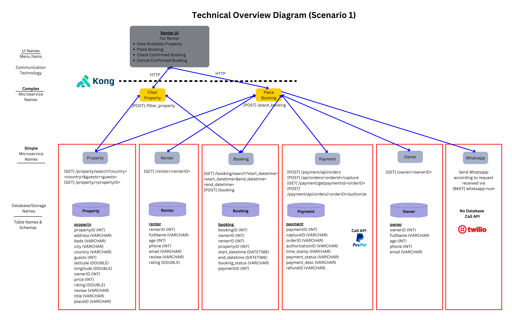

  
Expand for Screenshots of Scenario 1

  

        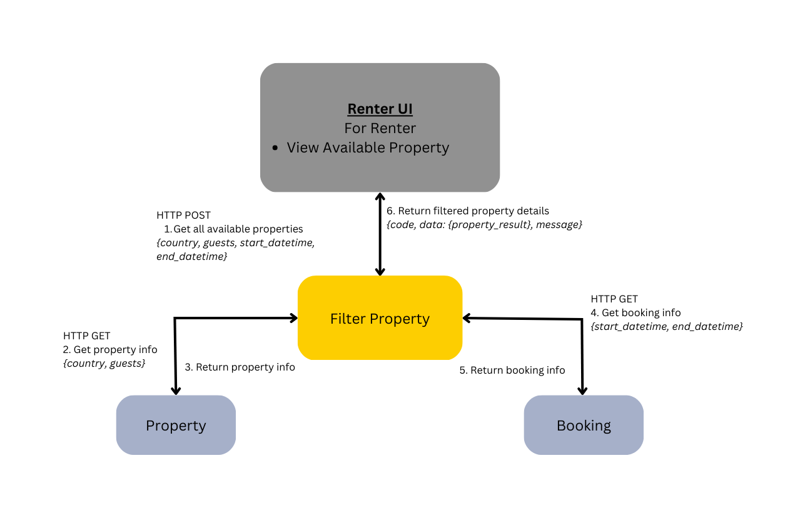
        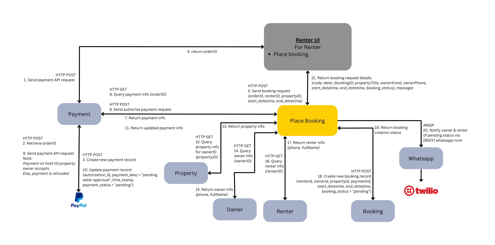
        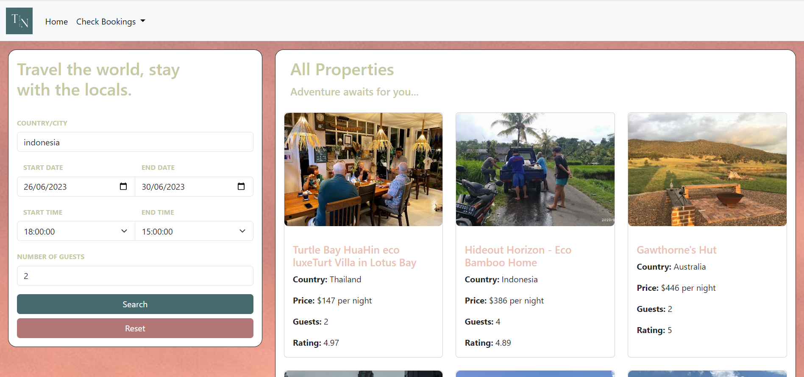
        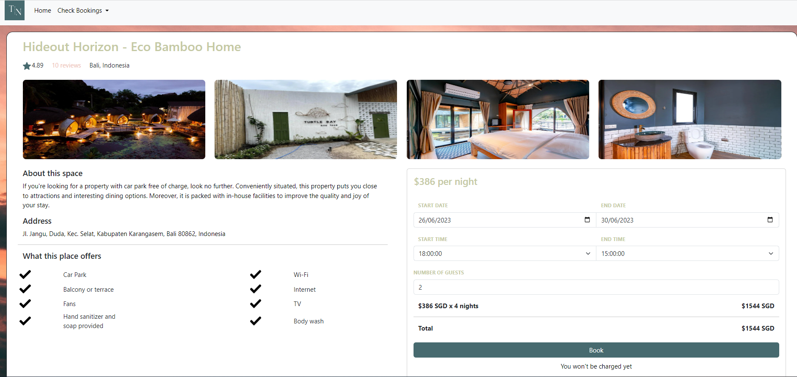
        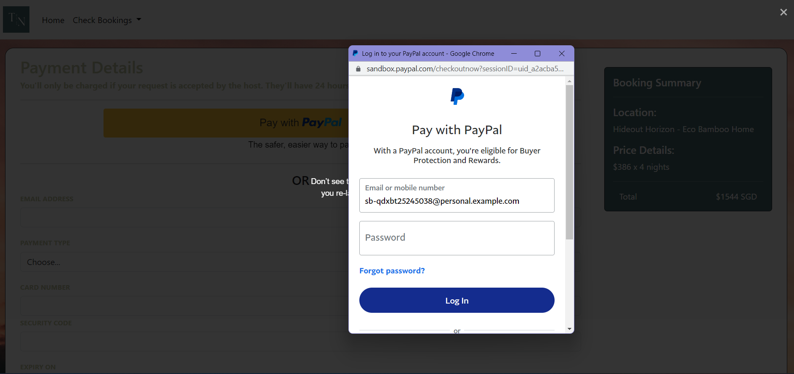
        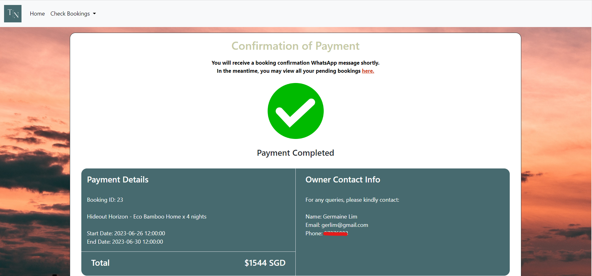
    

### Payment Credentials
<ul>
    <li>Email: sb-qdxbt25245038@personal.example.com</li>
    <li>Password: nLo/9h=K</li>
</ul>

(<a href="#top">back to top</a>)

## Scenario 2
Owner logs in and accept/reject bookings

	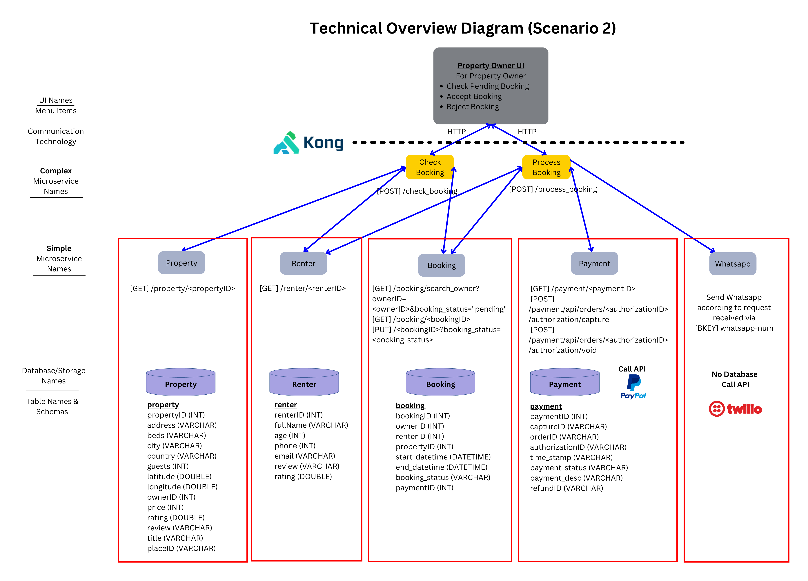

  
Expand for Screenshots of Scenario 2

  

        
        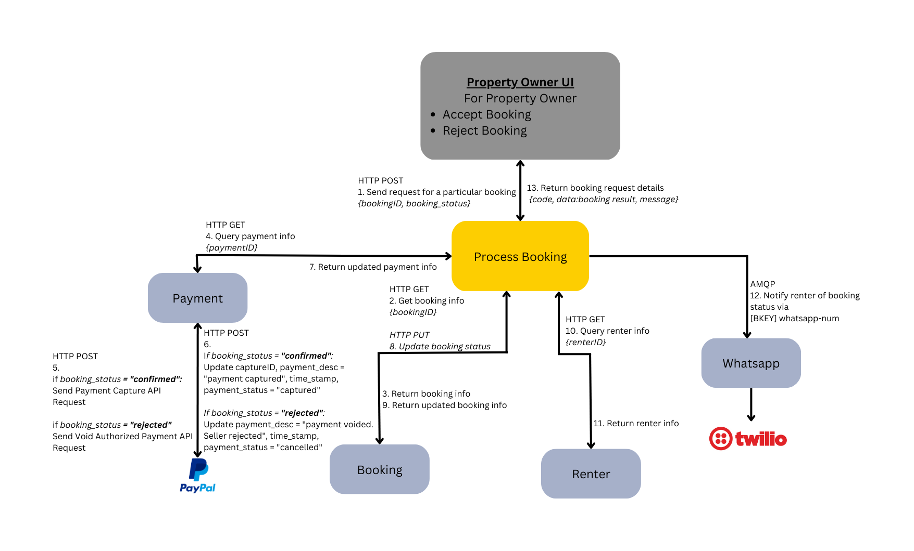
        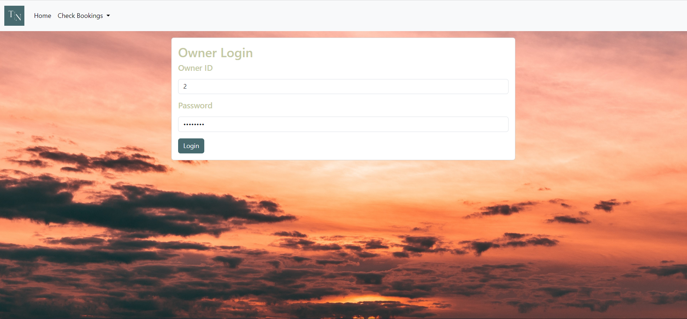
        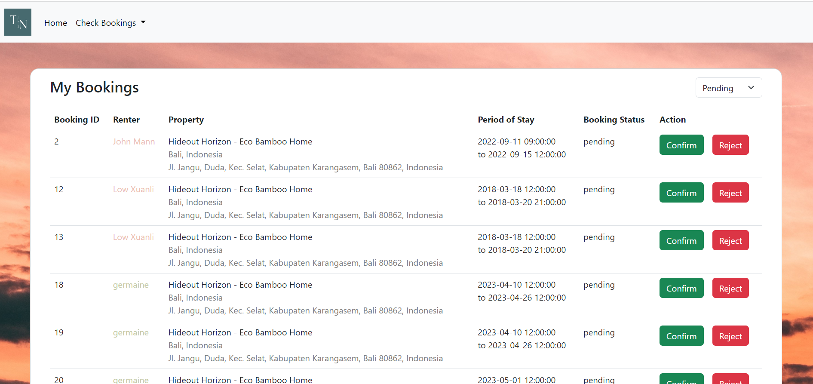
        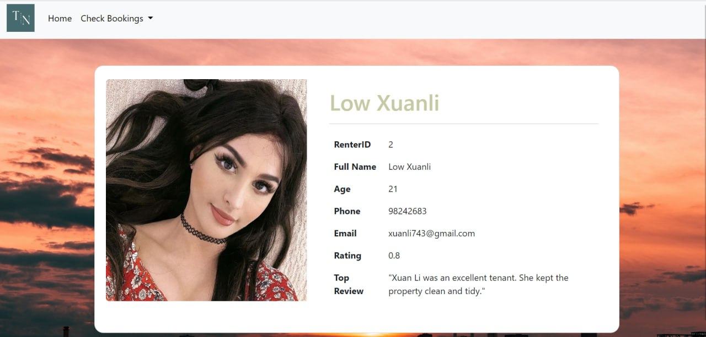
        
    

(<a href="#top">back to top</a>)

## Scenario 3
Renter cancels confirmed booking

	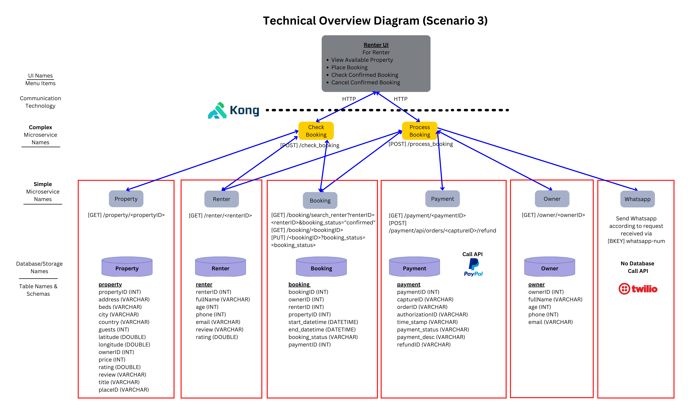

  
Expand for Screenshots of Scenario 2

  

        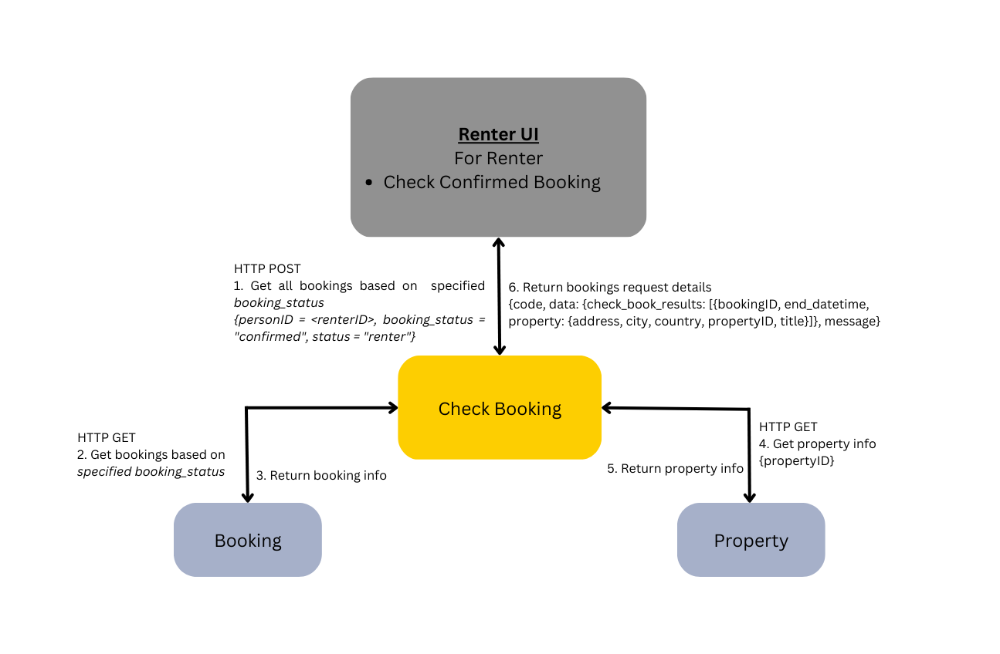
        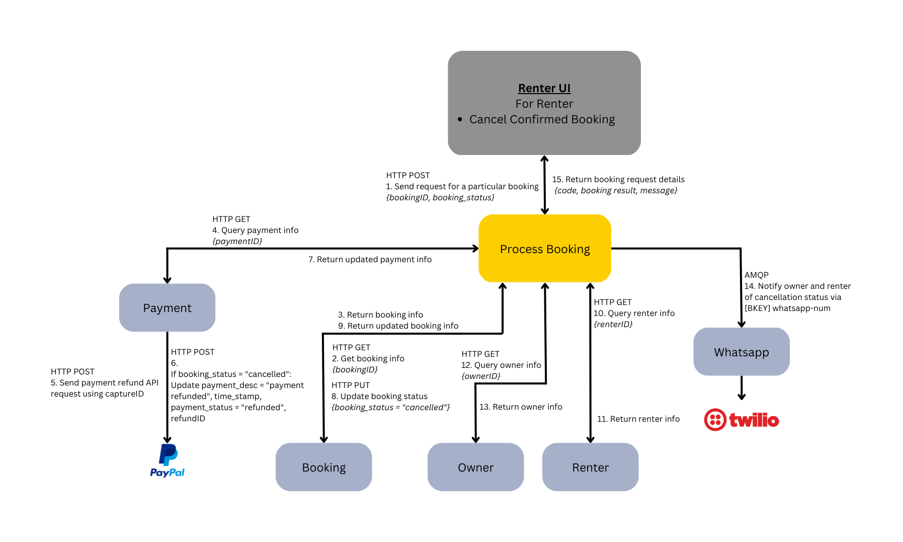
        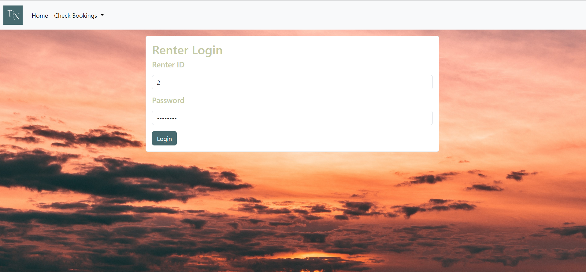
        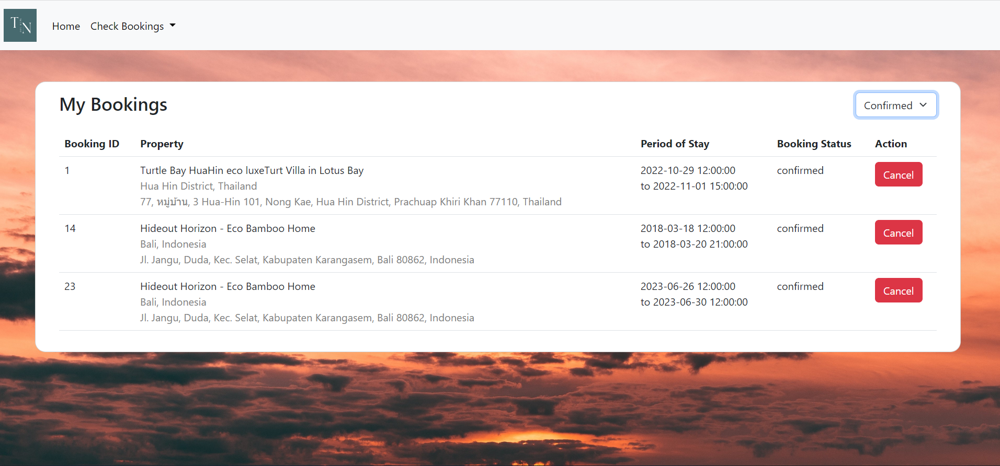
        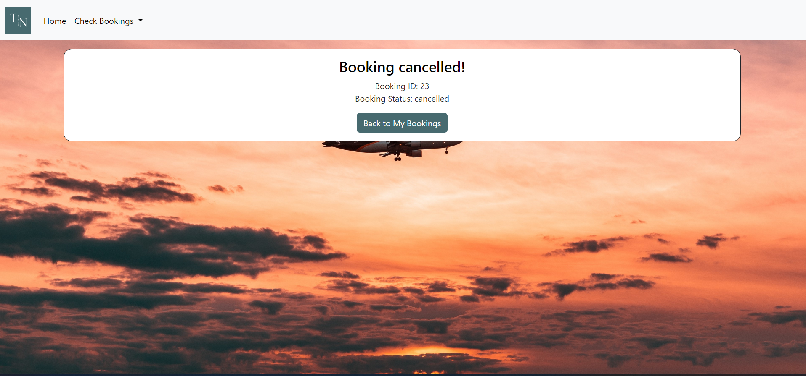
    

	

(<a href="#top">back to top</a>)

## Additional Points
1. Kong API gateway helps to manage ports and route the requests to the correct (micro)services based on the specified ports and routes. As Kong API gateway sits in between the user interface and the (micro)services, it provides a centralised management of the APIs. By using a single port 8000, it therefore simplifies the configuration and management of all the APIs.
2. Property, Booking, Owner and Renter simple microservice and Payment service is coded in Java SpringBoot. This is to highlight that the microservices are language agnostic.
3. Google Places API is used to retrieve images using placeID of each property
4. Twilio API is used to give renters and owners booking status notifications through their mobile numbers. 
5. PayPal API is used to facilitate the booking fee payment between renters and owners
- Hold Payment
- Capture Payment
- Void Payment
- Refund Payment

(<a href="#top">back to top</a>)

<!-- ACKNOWLEDGMENTS -->
## Acknowledgments

* [Tan Li Xuan Germaine](https://github.com/germainetan)
* [Mohammad Fadhli Bin Abdul Nassir](https://github.com/mohammadfadhli)
* [Low Xuanli](https://github.com/xuanli286)
* [Cydnie Na Xin Yee](https://github.com/cydniena)
* [Chua Yee Tong Sharon](https://github.com/scyt01)
* [Gilea Joyce Lovedorial Ticsay](https://github.com/joycelovedorial)

(<a href="#top">back to top</a>)
